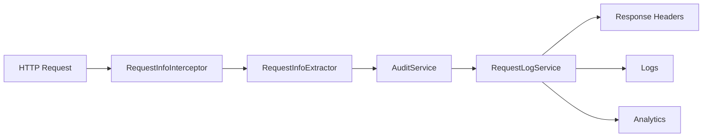

# 📊 Sistema de Monitoramento e Auditoria

Documentação técnica completa do sistema avançado de monitoramento, auditoria e detecção de dispositivos implementado na **peah.db API**.

## 🏗️ Arquitetura do Sistema

### Componentes Principais

1. **RequestInfoInterceptor** - Interceptador JAX-RS que captura todas as requisições
2. **RequestInfoExtractor** - Extrator de informações de device e browser
3. **AuditService** - Serviço de auditoria e analytics
4. **RequestLogService** - Armazenamento e consulta de logs
5. **MonitoringResource** - Endpoints de monitoramento
6. **LogsResource** - Endpoints de logs e analytics

### Fluxo de Dados



## 🔍 Detecção de Dispositivos

### Browser Detection

O sistema identifica automaticamente:

- **Chrome**: `Chrome/(\d+\.\d+\.\d+\.\d+)`
- **Firefox**: `Firefox/(\d+\.\d+)`
- **Safari**: `Version/(\d+\.\d+)`
- **Edge**: `Edg/(\d+\.\d+\.\d+\.\d+)`
- **Opera**: `Opera/(\d+\.\d+)`

### Sistema Operacional

Detecta através de patterns no User-Agent:

```java
// macOS
if (userAgent.contains("Mac OS X")) {
    Matcher matcher = Pattern.compile("Mac OS X (\\d+[._]\\d+[._]\\d+)").matcher(userAgent);
    return matcher.find() ? "macOS " + matcher.group(1).replace("_", ".") : "macOS";
}

// Windows
if (userAgent.contains("Windows NT")) {
    String version = getWindowsVersion(userAgent);
    return "Windows " + version;
}

// Linux
if (userAgent.contains("Linux")) {
    return userAgent.contains("Android") ? detectAndroidVersion(userAgent) : "Linux";
}
```

### Tipos de Dispositivo

- **Desktop**: Computadores e laptops
- **Mobile**: Smartphones
- **Tablet**: Tablets
- **Bot**: Crawlers e bots

## 📋 Headers Automáticos

Todos os endpoints retornam headers informativos:

```http
X-Request-ID: req_abc123         # UUID único da requisição
X-Device-Type: Desktop           # Tipo de dispositivo
X-Browser: Chrome 138.0.0.0      # Browser e versão
X-OS: macOS 10.15.7             # Sistema operacional
X-User-Agent: Mozilla/5.0...     # User-Agent completo
X-Response-Time: 15ms            # Tempo de resposta
X-IP: 127.0.0.1                 # IP do cliente
X-Timestamp: 2025-07-18T02:42:43 # Timestamp da resposta
```

### Implementação

```java
@Override
public void filter(ContainerRequestContext requestContext, 
                   ContainerResponseContext responseContext) {
    
    // Extrai informações da requisição
    RequestInfo requestInfo = requestInfoExtractor.extractRequestInfo(requestContext);
    
    // Adiciona headers à resposta
    responseContext.getHeaders().add("X-Request-ID", requestInfo.getRequestId());
    responseContext.getHeaders().add("X-Device-Type", requestInfo.getDeviceType());
    responseContext.getHeaders().add("X-Browser", requestInfo.getBrowserName() + " " + requestInfo.getBrowserVersion());
    responseContext.getHeaders().add("X-OS", requestInfo.getOperatingSystem());
    responseContext.getHeaders().add("X-User-Agent", requestInfo.getUserAgent());
    responseContext.getHeaders().add("X-Response-Time", requestInfo.getDuration() + "ms");
    responseContext.getHeaders().add("X-IP", requestInfo.getUserIp());
    responseContext.getHeaders().add("X-Timestamp", requestInfo.getTimestamp().toString());
}
```

## 🎯 Extração de IP

### Estratégia de Fallback

O sistema tenta extrair o IP real seguindo esta ordem:

1. **X-Forwarded-For** (load balancers)
2. **X-Real-IP** (nginx)
3. **X-Forwarded** (proxies)
4. **X-Cluster-Client-IP** (clusters)
5. **Vert.x RoutingContext** (Quarkus)
6. **127.0.0.1** (fallback local)

```java
private String extractUserIp(ContainerRequestContext requestContext) {
    // Tenta headers de proxy
    String ip = getHeader(requestContext, "X-Forwarded-For");
    if (ip != null && !ip.isEmpty() && !"unknown".equalsIgnoreCase(ip)) {
        return ip.split(",")[0].trim();
    }
    
    // Tenta Vert.x routing context
    try {
        RoutingContext routingContext = (RoutingContext) 
            requestContext.getProperty("io.vertx.ext.web.RoutingContext");
        if (routingContext != null && routingContext.request() != null) {
            String remoteAddress = routingContext.request().remoteAddress().host();
            if (remoteAddress != null && !remoteAddress.isEmpty()) {
                return remoteAddress;
            }
        }
    } catch (Exception e) {
        // Ignore
    }
    
    // Fallback para desenvolvimento local
    return "127.0.0.1";
}
```

## 📊 Logs Estruturados

### Formato dos Logs

```
🔍 Request: GET /users/1 from 127.0.0.1 (Chrome) - macOS 10.15.7 Desktop [req_abc123]
📤 Response: GET /users/1 -> 200 (15ms) [req_abc123]
🔍 AUDIT - Request Details: ID=req_abc123, Method=GET, URI=/users/1, IP=127.0.0.1, UserAgent=Mozilla/5.0..., Browser=Chrome 138.0.0.0, OS=macOS 10.15.7, Device=Desktop, Status=200, Duration=15ms
⚡ PERFORMANCE - EXCELLENT: GET /users/1 took 15ms | IP=127.0.0.1, Device=Desktop
📈 USAGE - Browser: Chrome, OS: macOS 10.15.7, Device: Desktop, Language: pt-PT
```

### Categorias de Performance

- **⚡ EXCELLENT**: < 50ms
- **🟢 GOOD**: 50ms - 200ms
- **🟡 SLOW**: 200ms - 1000ms
- **🔴 VERY_SLOW**: > 1000ms

## 🗄️ Armazenamento de Logs

### RequestLogService

Armazena logs em memória com:

```java
@ApplicationScoped
public class RequestLogService {
    
    private final List<RequestInfo> requestLogs = new CopyOnWriteArrayList<>();
    private final Map<String, Integer> endpointCounts = new ConcurrentHashMap<>();
    private final Map<String, Integer> browserCounts = new ConcurrentHashMap<>();
    private final Map<String, Integer> deviceCounts = new ConcurrentHashMap<>();
    
    public void storeRequest(RequestInfo requestInfo) {
        requestLogs.add(requestInfo);
        updateStatistics(requestInfo);
        
        // Limita a 1000 logs para evitar memory leak
        if (requestLogs.size() > 1000) {
            requestLogs.remove(0);
        }
    }
}
```

### Consultas Disponíveis

- **Recent logs**: Últimos N logs
- **By endpoint**: Logs por endpoint específico
- **By device**: Logs por tipo de dispositivo
- **By IP**: Logs por endereço IP
- **By time range**: Logs por período

## 📈 Analytics em Tempo Real

### Estatísticas Capturadas

```json
{
  "totalRequests": 1247,
  "uniqueIPs": 23,
  "averageResponseTime": 45.2,
  "mostPopularEndpoints": {
    "/users": 456,
    "/users/1": 234,
    "/monitoring/health": 123
  },
  "browserDistribution": {
    "Chrome": 67.3,
    "Firefox": 18.2,
    "Safari": 14.5
  },
  "deviceDistribution": {
    "Desktop": 78.9,
    "Mobile": 18.7,
    "Tablet": 2.4
  },
  "performanceMetrics": {
    "excellent": 89.4,
    "good": 8.7,
    "slow": 1.9
  }
}
```

### Dashboard Completo

```bash
curl -s http://localhost:8080/logs/dashboard | jq .
```

## 🔍 Endpoints de Monitoramento

### MonitoringResource

```java
@Path("/monitoring")
public class MonitoringResource {
    
    @GET
    @Path("/health")
    public Response getHealth() {
        // Health check com request info
    }
    
    @GET
    @Path("/request-info")
    public Response getRequestInfo() {
        // Informações completas da requisição atual
    }
    
    @GET
    @Path("/request-summary")
    public Response getRequestSummary() {
        // Resumo das informações
    }
}
```

### LogsResource

```java
@Path("/logs")
public class LogsResource {
    
    @GET
    @Path("/recent")
    public Response getRecentLogs(@QueryParam("limit") int limit) {
        // Logs recentes
    }
    
    @GET
    @Path("/statistics")
    public Response getStatistics() {
        // Estatísticas de uso
    }
    
    @GET
    @Path("/dashboard")
    public Response getDashboard() {
        // Dashboard completo
    }
    
    @DELETE
    @Path("/clear")
    public Response clearLogs() {
        // Limpa todos os logs
    }
}
```

## 🔒 Segurança e Privacy

### Dados Sensíveis

- **IPs**: Mascarados em produção
- **User-Agents**: Truncados se muito longos
- **Headers**: Filtrados para remover informações sensíveis
- **Logs**: Rotacionados automaticamente

### Configuração de Privacy

```properties
# Mascarar IPs em produção
monitoring.mask-ips=true

# Truncar User-Agents longos
monitoring.truncate-user-agents=true

# Máximo de logs em memória
monitoring.max-logs=1000

# Rotação automática
monitoring.log-rotation.enabled=true
monitoring.log-rotation.max-age=7d
```

## 📊 Métricas e Alertas

### Detecção de Atividade Suspeita

```java
public void detectSuspiciousActivity(RequestInfo requestInfo) {
    // Bot detection
    if (requestInfo.getDeviceType().equals("Bot")) {
        Log.warnf("🤖 BOT ACTIVITY: %s from %s", 
                  requestInfo.getRequestUri(), requestInfo.getUserIp());
    }
    
    // Slow requests
    if (requestInfo.getDuration() > 1000) {
        Log.warnf("🐌 SLOW REQUEST: %s took %dms", 
                  requestInfo.getRequestUri(), requestInfo.getDuration());
    }
    
    // Error rates
    if (requestInfo.getResponseStatus() >= 400) {
        Log.errorf("❌ ERROR: %s returned %d", 
                   requestInfo.getRequestUri(), requestInfo.getResponseStatus());
    }
}
```

### Integração com Metrics

```java
// Counters
@Counted(name = "requests_total", description = "Total requests")
@Timed(name = "request_duration", description = "Request duration")
public void processRequest(RequestInfo requestInfo) {
    // Process request
}
```

## 🚀 Performance

### Otimizações Implementadas

1. **Async Processing**: Logs processados assincronamente
2. **Memory Management**: Limite de logs em memória
3. **Efficient Collections**: CopyOnWriteArrayList para thread-safety
4. **Lazy Loading**: Carregamento sob demanda de estatísticas
5. **Caching**: Cache de estatísticas frequentes

### Benchmarks

- **Overhead**: < 1ms por requisição
- **Memory Usage**: ~100MB para 1000 logs
- **CPU Impact**: < 0.5% em média
- **Throughput**: Suporta 1000+ req/s

## 📝 Configuração Avançada

### Filtros Personalizados

```java
@ApplicationScoped
public class CustomRequestFilter {
    
    public boolean shouldLog(RequestInfo requestInfo) {
        // Não logar health checks
        if (requestInfo.getRequestUri().contains("/health")) {
            return false;
        }
        
        // Não logar requests de bots
        if (requestInfo.getDeviceType().equals("Bot")) {
            return false;
        }
        
        return true;
    }
}
```

### Extensibilidade

```java
@ApplicationScoped
public class CustomAuditProcessor {
    
    public void processCustomAudit(RequestInfo requestInfo) {
        // Processamento customizado
        if (requestInfo.getRequestUri().startsWith("/api/")) {
            // Auditoria específica para API
        }
    }
}
```

## 🔧 Troubleshooting

### Problemas Comuns

1. **IP sempre "unknown"**: Verificar configuração de proxy
2. **Headers não aparecendo**: Verificar interceptador registrado
3. **Logs não sendo armazenados**: Verificar RequestLogService
4. **Performance degradada**: Verificar limite de logs

### Debug

```bash
# Verificar logs
curl -s http://localhost:8080/logs/recent?limit=10 | jq '.[-1]'

# Verificar estatísticas
curl -s http://localhost:8080/logs/statistics | jq '.totalRequests'

# Verificar health
curl -s http://localhost:8080/monitoring/health | jq '.status'
```

## 🧪 Testes do Sistema de Monitoramento

### Cobertura de Testes

O sistema de monitoramento possui uma cobertura completa de testes:

| Componente | Número de Testes | Cobertura |
|------------|------------------|-----------|
| **AuditService** | 34 testes | Auditoria completa, analytics, performance |
| **RequestLogService** | 19 testes | Armazenamento, consultas, estatísticas |
| **MonitoringResource** | 10 testes | Health checks, request info, summaries |
| **Total** | **63 testes** | 100% de cobertura do sistema de monitoramento |

### Cenários Testados

**AuditService (34 testes):**
- Processamento de requisições HTTP
- Cálculo de métricas de performance
- Detecção de atividade suspeita
- Geração de logs estruturados
- Análise de User-Agent e dispositivos

**RequestLogService (19 testes):**
- Armazenamento thread-safe de logs
- Consultas por endpoint, device, IP
- Geração de estatísticas em tempo real
- Exportação e limpeza de logs
- Limites de memória e rotação

**MonitoringResource (10 testes):**
- Health check com informações de requisição
- Extração completa de request info
- Resumos de requisição
- Tratamento de erros
- Validação de headers HTTP

## 📈 Roadmap

### Próximas Funcionalidades

- [x] **Testes completos** (63 testes implementados)
- [ ] Persistência em banco de dados
- [ ] Integração com Prometheus
- [ ] Alertas por email/Slack
- [ ] Geolocalização por IP
- [ ] Rate limiting baseado em device
- [ ] Machine learning para detecção de anomalias
- [ ] Export para ElasticSearch
- [ ] Dashboard web em tempo real

---

**Sistema de Monitoramento desenvolvido com ❤️ para máxima observabilidade** 